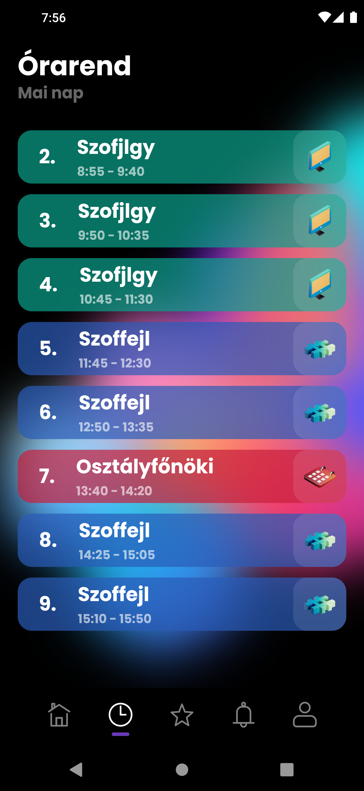

# Mini Napló

## A modern E-diary with the help of kreta-api. 
### Created this project for school, and to learn Flutter 

## UI

    

        
        
Login

    

    

        
        
Home

    

    

        
        
Timetable

    

    

        
        
Absences

    

### About
- Only useable for my school [VBJ] 
- Needs network to load data

#### project is discontinued
#### reason: wanted to start from ground up 

